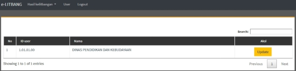
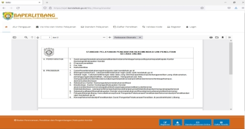
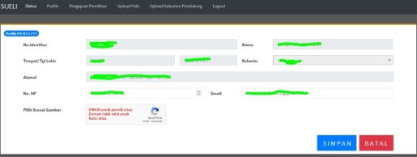

**Buku Petunjuk Penggunan Aplikasi (User Manual)** **SISTEM INFORMASI** 

**JARINGAN PENELITIAN (SIJELI)** 

**BADAN PERENCANAAN, PENELITIAN DAN PENGEMBANGAN** **KABUPATEN KENDAL** 

**2021** 

**1.  PENDAHULUAN** 

1. **Tujuan Pembuatan Dokumen** 

Dokumen user manual Aplikasi Sistem Jaringan Penelitian ini dibuat untuk tujuan sebagai berikut: 

1. Menggambarkan dan menjelaskan penggunaan aplikasi SIJELI untuk *User* 
1. Sebagai panduan penggunaan aplikasi SIJELI ini. 
2. **Deskripsi Umum Sistem** 
1. **Deskripsi Umum Aplikasi** 

   Deskripsi  umum  aplikasi  meliputi  deskripsi  umum  Sistem  Informasi  Jaringan Penelitian yang dikembangkan, fungsi utama Sistem Informasi Jaringan Penelitian yang akan diberikan kepada pengguna  

2. **Deskripsi Umum Kebutuhan Aplikasi** 

   Deskripsi umum kebutuhan aplikasi yang akan diimplementasikan meliputi semua informasi yang bersifat teknis yang menjadi acuan dalam pengembangan aplikasi. 

3. **Deskripsi Dokumen**  

   Dokumen  ini  dibuat  untuk  memberikan  panduan  penggunaan  aplikasi  **Sistem Jaringan Penelitian***.* Dokumen ini berisikan informasi sebagai berikut: 

1. **BAB I**.** Berisi informasi umum yang merupakan bagian pendahuluan, yang meliputi tujuan pembuatan dokumen, deskripsi umum sistem serta deskripsi dokumen. 
1. **BAB II** 

   Berisi perangkat yang dibutuhkan untuk penggunaan aplikasi SIJELI meliputi perangkat lunak dan perangkat hardware 

3. **BAB III** 

   Berisi *user manual* aplikasi SIJELI  

**2.  PERANGKAT YANG DIBUTUHKAN** 

1. **Perangkat Lunak** 

   Perangkat lunak yang digunakan adalah: 

1. Windows sebagai *Operating System.* 
1. Firefox/Google Chrome sebagai *Tools* Penjelajah *(Web Browser).* 
2. **Perangkat Keras** 

   Perangkat keras yang digunakan adalah: 

1. Komputer  
1. Mouse sebagai peralatan antarmuka 
1. Monitor sebagai peralatan antarmuka 
1. Keyboard sebagai peralatan antarmuka. 
3. **Pengguna Aplikasi** 

   Pengguna aplikasi yang akan menggunakan aplikasi adalah sebagai berikut: 

   1. Memiliki pemahaman tentang antar muka komputer 
   1. Memiliki pemahaman proses bisnis aplikasi. 
3. **MENU DAN CARA PENGGUNAAN** 
1. **Struktur Menu** 

   Adapun  struktur  menu  pada  Aplikasi  Sistem  Jaringan  Penelitian (SIJELI).Baperlitbang Kabupaten Kendal adalah sebagai berikut: 

1. **Menu Tampilan Awal** 
1. **Menu Kajian OPD** 
- Beranda 
- Profil 
- Kelitbangan 
- Publikasi 
3. **Menu Layanan Ijin Penelitian** 
- Beranda 
- Alur Pengajuan 
- Visi Misi dan Motto Pelayanan 
- Standar Pelayanan 
- Daftar Penelitian 
- Validasi Kode 
- Register 
- Login 
2. **Pengguna** 

   Pada bagian ini akan dijelaskan mengenai menu-menu yang ada pada website dan tata 

   cara memasukkan data. 

1. **Cara Membuka Situs** 

   Untuk memulai akses terhadap aplikasi SIJELI ini: 

1. Bukalah aplikasi SIJELI melalui web browser (IE atau Mozila FireFox atau lainnya) dengan alamat url sebagai berikut: https://sijeli.kendalkab.go.id 
1. Kemudian  tekan  **Enter**  pada  tombol  keyboard  atau  klik  tombol  **Go**  pada browser. 
1. Akan muncul tampilan halaman depan aplikasi SIJELI. 

Maka pada layar akan tampak menu Halaman Pembuka / Awal situs SIJELI seperti pada gambar 3.1. 

2. **Halaman Kajian OPD** 

   Klik gambar pada website yang terdapat tulisan “Kajian OPD” makan akan muncul tampilan sebagai berikut: 

   

   Pada  halaman  ini  akan  terlihat  menu-menu  pada  bagian  atas  :  Beranda,  Profil, Kelitbangan, dan Publikasi 

   

1. Beranda 

   Pada menu menampilkan halaman awal dari Kajian OPD yang berisi ringkasan dari menu-menu dari SIJELI menu Kajian OPD 

2. Profil  

   Pilihan yang muncul dalam menu ini adalah Definisi, Selayang Pandang, Struktur Organisasi, Regulasi 

   

1) Definisi merupakan halaman yang berisi tentang defisini Litbang (Penelitian dan Pengembangan) 

   

2) Struktur Organisasi 

   Halaman ini menampilkan struktur organisasi Litbang Kabupaten Kendal yang tergabung  dengan  Perencanaan  Pembangunan  dalam  Badan  Perencanaan, Penelitian dan Pengembangan Kabupaten Kendal  

   

3) Regulasi 

   Halaman ini menampilkan peraturan-peraturan yang berkaitan dengan penelitian dan pengembangan khususnya yang menjadi dasar untuk pemerintah daerah  

   

3. Kelitbangan 

   Pilihan yang muncul dalam menu ini adalah Sosial dan Pemerintahan, Ekonomi dan 

   Pembangunan, Inovasi dan Teknologi 

   

   Dalam sub-sub menu tersebut akan menampilkan kajian-kajian yang dilaksanakan oleh Perangkat Daerah sesuai pengelompokan bidangnya. 

1) Sosial dan Pemerintahan 

   Berisi kajian-kajian bidang social dan pemerintahan 

2) Ekonomi dan Pembangunan 

   Berisi kajian-kajian bidang ekonomi dan pembangunan 

3) Inovasi dan Teknologi 

   Berisi kajian-kajian bidang inovasi dan teknologi 

4. Publikasi 

   Pilihan yang muncul dalam menu ini adalah SOP Kelitbangan, Informasi, Agenda Kegiatan, Foto Kegiatan, Download 

   

1) SOP Kelitbangan 

   Berisi tentang prosedur standar yang berkaitan dengan kegiatan penelitian dan pengembangan 

2) Informasi 

   Berisi  tentang  informasi  dan  pengumuman  yang  terkait  dengan  kegiatan penelitian dan pengembangan 

3) Agenda Kegiatan 

   Berisi jadwal-jadwal kegiatan penelitian dan pengembangan yang telah dan atau akan dilaksanakan. 

4) Foto Kegiatan 

   Berisi  tentang  dokumentasi  kegiatan  penelitian  dan  pengembangan  yang dilaksanakan  oleh  bidang  penelitian  dan  pengembangan  pada  Baperlitbang Kabupaten Kendal 

5) Download 

   Berisi  tentang  pengumuman/panduan/formulir  kegiatan  penelitian  dan pengembangan yang perlu di unduh untuk diisi 

3. **Halaman Kajian OPD (Khusus Bagi Perangkat Daerah)** 
1. Bukalah aplikasi SIJELI melalui web browser (IE atau Mozila FireFox atau lainnya) dengan alamat url sebagai  berikut: [ https://sijeli.kendalkab.go.id/pagelitbang/login ](https://sijeli.kendalkab.go.id/pagelitbang/login)maka akan tampil menu login seperti pada gambar. 

   

2. Setelah berhasil login, maka akan tampil seperti pada gambar 

   

3. Selanjutnya adalah langkah menginput hasil penelitian/kajian/studi dengan meng klik menu hasil kelitbangan sesuai bidangnya.  

   

   

4. Selanjutnya klik tombol “+Baru” untuk memulai proses input kajian/studi untuk dipublikasi 

   

5. Bila sudah selesai input,klik tombol “Simpan” agar data masuk ke server dan klik tombol “Kosong” untuk menginput kajian/studi atau klik tombol  “Tutup” untuk selesai proses input dan kembali ke menu sebelumnya. 
5. Klik menu “User” untuk melalukan perubahan sandi yaitu dengan cara klik tombol “Update”  

   

   Dan akan tampil halaman seperti pada gambar. Isikan password baru pada kolom “Password …” dan klik tombol “Simpan” untuk menyimpan atau klik tombol “Batal” untuk membatalkan penggantian password 

   

7. Klik menu “Logout” untuk keluar dan kembali ke tampilan “Kajian OPD” 
4. **Halaman Ijin Penelitian** 

   Klik gambar pada website yang terdapat tulisan “Layanan Ijin Penelitian” makan akan muncul tampilan sebagai berikut: 

   

   Pada halaman ini akan terlihat menu-menu pada bagian atas : Home (Gambar Rumah), Alur Pengajuan, Visi mIsi dan Moto Pelayanan, Standar Pelayanan, Daftar Penelitian, Validasi Kode, Register, Login 

   

1. Home (gambar Rumah) 

   Disini menampilkan Maklumat Pelayanan dan Alur Pengajuan Pennelitian 

2. Alur Pengajuan  

   Disini menampilkan alur proses pengajuan ijin penelitian di Kabupaten Kendal pada aplikasi yaitu Registrasi – Login - Upload 

   

3. Visi Misi dan Motto Pelayanan 

   Disini menampilkan visi, misi dan motto pelayanan 

   

4. Standar Pelayanan 

   Disini  menampilkan  standar  pelayanan  penerbitan  ijin  penelitian  di  Kabupaten Kendal  yang  mencakup  persyaratan,  prosedur,  waktu,  biaya  pelayanan,  produk layanan dan pengaduan 

   

5. Daftar Penelitian 

   Disini menampilkan penelitian-penelitian yang telah diterbitkan ijin penelitiannya. Halaman ini dapat digunakan sebagai halaman pemantau penerbitan ijin penelitian. 

   

6. Validasi Kode 

   Disini  menampilkan halaman  yang berguna untuk memeriksa keaslian surat ijin penelitian yang telah diterbitkan. Kode validasi tercantum pada bagian bawah surat ijin penelitian yang telah diterbitkan.  

   

7. Register 

   Disini menampilkan halaman untuk registrasi ketika mau mengajukan ijin penelitian. Hal-hal yang harus diisikan meliputi :  

- nomor identitas (no. KTP),  
- nama sesuai KTP,  
- tempat/tanggal lahir sesuai KTP,  
- jenis kelamin sesuai KTP,  
- alamat  lengkap  yang  akan  digunakan  untuk  pengiriman  hardcopy  surat  ijin penelitian (alamat tidak harus sesuai dengan KTP),  
- status, nomor telpon/HP yang dapat dihubungi,  
- email yang masih aktif,  
- password yang akan digunakan untuk login pada aplikasi ini 
- Captcha untuk keamanan aplikasi 

8. Login 

   Disini akan menampilkan menu login dimana yang dibutuhkan untuk login adalah 

   nomor identitas dan password yang telah diinputkan pada waktu registrasi. 

   

   Setelah berhasil login maka akan muncul halaman status yang menampilkan status posisi pengajuan penelitian, menu cetak ijin penelitian (akan aktif ketika status posisi pengajuan  sudah  berada  pada  Baperlitbang),  dan  menu  Isi  Survai  Kepuasan Pelayanan 

   

   Pada bagian atas halaman ini ada beberapa menu 

   

- Profil  

  

  Catatan: 

  Menu ini bisa dilewati bila data yang diisikan pada waktu registrasi tidak ada perubahan. Item yang dapat dirubah pada menu ini hanya nomor telpon/HP dan alamat e-mail saja. 

- Pengajuan Penelitian 

  

  Catatan: 

1) Baris “Ditunjukan kepada” bisa dipilih dari data yang sudah ada di system. Dan  bila  belum  ada  data  dalam  system,  bisa  klik  tombol  +  untuk menambahkan lembaga/instansi yang dituju; 
1) Baris “Lokasi Penelitian” bisa diisikan lembaga/instansi yang dituju atau wilayah lokasi penelitian 
1) Baris “Judul Penelitian” diisikan dengan judul penelitian sesuai dengan surat pengantar dari instasi/kampus 
4) Baris “Deskripsi” diisikan latar belakang, permasalahan, tujuan penelitian. Maksimal karakter dalam kolom ini adalah 1.000 karakter; 
4) Baris “Pekerjaan” bisa dipilih dari pilihan yang ada; 
4) Baris “Kampus/Instansi” diisikan kampus/instansi asal 
4) Baris “Fakultas & Jurusan / Bagian” disikan sesuai data yang ada 
4) Baris “Penanggung Jawab” diisikan dengan nama pejabat penanda tangan surat keterangan dari instansi/kampus 
- Upload Foto 

  

  Catatan : 

1) Upload foto yang berukuran 3 x 4  dalam format file JPG dengan ukuran antara 50 – 100 kb 
1) Bila mengalami kegagalan upload foto, bisa disiasati dengan mengupload foto hasil screenshot pada smartphone atau PC 
- Upload Dokumen Pendukung 

  

  Catatan : 

1) Kartu identitas dan surat keterangan dari instansi/kampus dijadikan dalam 1 file dengan format Pdf dan berukuran antara 30-800 kb. 
1) Bila mengalami kegagalan upload bisa disiasati dengan mengkompres file PDF dengan aplikasi online pdf compressor. Upload berhasil bila file sudah dapat dipreview dengan meng klik tombol “preview”; 
3) Wajib klik “Simpan dan Finish” bila sudah menyelesaikan tahapan pengisian data yang diminta, agar tersimpan dan data terkirim ke server. 
- Logout 
20
